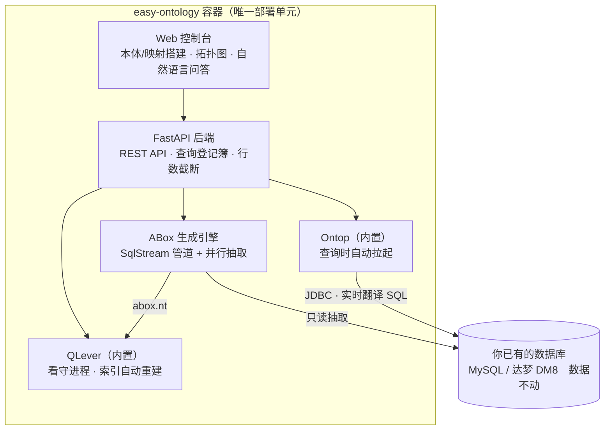
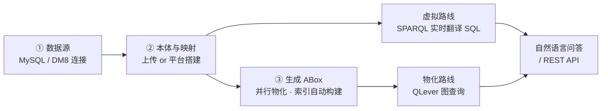
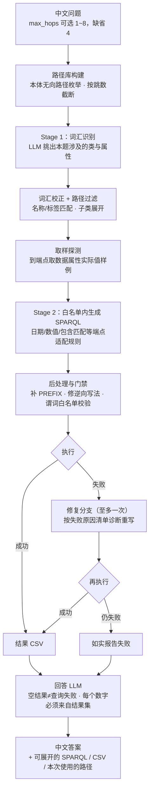

# Easy Ontology

**一个容器，把关系数据库变成知识图谱：可视化搭建本体与映射 → 直接查询/自然语言问数。内置 REST API，分钟级接入 Dify 等工作流，定制你的智能问数应用。**

Self-hosted OBDA (Ontology-Based Data Access) platform in a single Docker container: visually build OWL ontologies & R2RML mappings, query any relational database with SPARQL or plain natural language, and integrate into Dify / LLM workflows via ready-made REST APIs. Both query engines ([Ontop](https://ontop-vkg.org/) virtual + [QLever](https://qlever.cs.uni-freiburg.de/) materialized) are built in — nothing else to deploy or manage.


---

## 为什么是 Easy Ontology？

传统 OBDA 工具链的门槛在于：要用 Protégé 建本体、手写 OBDA 映射文件、命令行起 Ontop、再自己接查询前端——四件事四个工具。Easy Ontology 把它们收进一个 Web 界面：

- **🎨 平台搭建本体** — 不装 Protégé，浏览器里建类、对象属性、数据属性，支持公理，实时拓扑图预览
- **🔗 平台搭建映射** — 三步向导：选表 → 系统按外键关系自动推荐 JOIN → 生成 OBDA 映射
- **⚡ 查询引擎全自动** — Ontop 与 QLever 全部内置同一容器：端点查询时自动拉起，ABox 变化后索引自动重建，**用户不需要部署、启动、维护任何引擎**
- **💬 自然语言问数** — 配一个 DeepSeek API Key，中文提问 → 自动生成 SPARQL → 执行 → 回人话答案
- **🗂️ 多工作空间** — 多套本体/映射/数据源隔离，一键切换
- **🔌 对外 REST API** — `/sparql`、`/api/ask`、`/api/ontology/summary`，Dify / 外部系统改个 URL 就能接

支持 **MySQL** 与 **达梦 DM8**（国产数据库友好）。

## 架构

**单容器全栈**——查询引擎、索引守护全部内置，整个系统只有一个容器：



两条引擎由平台全自动管理，用户零操作：

| 引擎 | 工作方式 | 适合场景 |
|------|---------|---------|
| **Ontop**（虚拟） | 查询实时翻译成 SQL 直查数据库，不落盘 | 数据频繁变化，要最新结果 |
| **QLever**（物化） | 「③ 生成 ABox」把数据物化成三元组，索引秒级图查询；数据变化重新生成即可，索引自动重建 | 大数据量、复杂关联分析 |

## 快速开始

### 方式一：拉镜像一键起（推荐）

```bash
docker run -d --name easy-ontology \
  -p 8010:8000 \
  -v easy-ontology-data:/app/data \
  --add-host=host.docker.internal:host-gateway \
  --restart unless-stopped \
  zddsl/easy-ontology:latest
```

**容器启动后，浏览器访问 `http://localhost:8010`** 即可进入 Web 控制台（映射到容器内 8000 端口；数据持久化在 `easy-ontology-data` 卷里）。

> 如果部署在其他机器/服务器上，把 `localhost` 换成那台机器的 IP，例如 `http://192.168.1.100:8010`。

控制台长这样——左边配数据源、管本体与映射、一键物化；中间是本体拓扑图；下面是自然语言问答与 SPARQL 查询：


> 数据库在宿主机上？host 填 `host.docker.internal` 即可连通。
>
> 国内拉取 Docker Hub 慢或超时？给 Docker 配置镜像加速器（如阿里云个人加速地址），或在代理工具里放行 `registry-1.docker.io` 后重试。

### 方式二：源码构建

```bash
git clone https://github.com/zddsl/easy-ontology.git
cd easy-ontology
docker compose --profile prod up -d --build
```

### 首次使用三步

1. **① 数据源** — 填 MySQL/DM8 连接信息，点「测试连接」
2. **② 本体与映射** — 上传现成的 `.rdf`/`.obda`，或切到「平台搭建」在浏览器里可视化搭建
3. **查询** — 直接写 SPARQL；或在底部「自然语言问答」用中文提问（需先在顶栏「配置」里填 DeepSeek API Key）

想要物化加速？点一下「③ 生成 ABox」即可，索引自动构建，无需任何手动维护。



## 自然语言问答

顶栏「配置」→ 填入 [DeepSeek API Key](https://platform.deepseek.com/)，然后就可以：

> 「有多少名员工？」「这台设备工单领用了哪些物料？」

问答采用**两阶段管线**：先让 LLM 从本体路径库里挑出本题涉及的类与属性，再在白名单内生成 SPARQL——生成的查询只允许使用本体里真实存在的谓词，执行失败自动进入修复分支重写一次，回答层每个数字必须来自查询结果、查询失败与空结果严格区分。`max_hops` 参数（1~8，缺省 4）控制允许的最大关联跳数。



## 对外 API

平台本身就是个查询网关，外部系统（Dify、脚本、大屏）直接调用：

**SPARQL 查询**（Ontop 协议兼容；`route` 可省略，默认 `virtual`，生成过 ABox 后可用 `materialized`）

```bash
curl -X POST http://localhost:8010/sparql \
  -H "Accept: text/csv" \
  -d "query=SELECT ?s WHERE { ?s ?p ?o } LIMIT 10"
```

**自然语言问答**

```bash
curl -X POST http://localhost:8010/api/ask \
  -H "Content-Type: application/json" \
  -d '{"question": "有多少条工单？", "route": "materialized", "max_hops": 4}'
```

`route` 可省略（默认 `virtual`）；`max_hops` 可省略（默认 4，范围 1~8）。返回 `{answer, sparql, csv, used_paths, ...}`，`sparql`/`csv` 可用于前端展示核对。

**本体摘要**（喂给外部 LLM 做提示词）

```bash
curl http://localhost:8010/api/ontology/summary
# → { "ns": ..., "classes": [...], "obj_props": [...], "dt_props": [...] }
```

完整接口与参数说明见页面顶栏 **API** 按钮。

## 查询引擎：全自动，零维护

- **开箱即查** — 容器起来就能查询（虚拟引擎，实时翻译 SQL）
- **一键物化** — 点「③ 生成 ABox」，千万级三元组约 7 分钟（自研并行引擎），索引随后**自动构建**
- **自动跟随** — 数据变化重新生成、上传新 ABox、切换工作空间，索引都会自动重建，全程无需手动操作

> 进阶：想用外置 QLever（如已有的独立集群）？挂载自定义 `config.yaml` 覆盖 `rdf_store.base_url` 即可，参考 `deploy/qlever/watch-abox.sh`（外置看守版）。

## 开发模式

```bash
docker compose --profile dev up --build
```

源码 bind mount + uvicorn 热重载；Playground 前端改动用 `--profile build` 重新构建。

### 开发用外置 QLever 容器

开发环境除后端容器外还跑一个独立 `qlever` 容器（物化引擎，端口 7001）。容器没了别手敲
`docker run`——参数多且镜像必须按 digest 钉死，直接用脚本原样重建：

```bash
bash deploy/qlever/run-dev-container.sh --force   # 重建（镜像按 sha256 钉死，永不漂移）
bash deploy/qlever/regression-limit.sh            # 动过 QLever 版本后跑：ORDER BY+LIMIT 对拍回归
```

升级 QLever 的正确姿势：改 `run-dev-container.sh` 与 `Dockerfile` 里的 digest → 重建 →
跑 `regression-limit.sh` 对拍，PASS 才算升级成功。

## 发布镜像（维护者）

```bash
docker build --target prod -t zddsl/easy-ontology:latest .
docker push zddsl/easy-ontology:latest
```

## 致谢

- [Ontop](https://ontop-vkg.org/) (Apache-2.0) — 虚拟知识图谱引擎，`ontop-cli-5.5.0/` 随仓库分发
- [QLever](https://qlever.cs.uni-freiburg.de/) (Apache-2.0) — 超高性能 RDF 索引与查询，二进制取自官方镜像内置分发
- [WebVOWL / Ontology Playground](https://github.com/VisualDataWeb/Ontology-Playground) — 拓扑图可视化

## License

[MIT](LICENSE)
