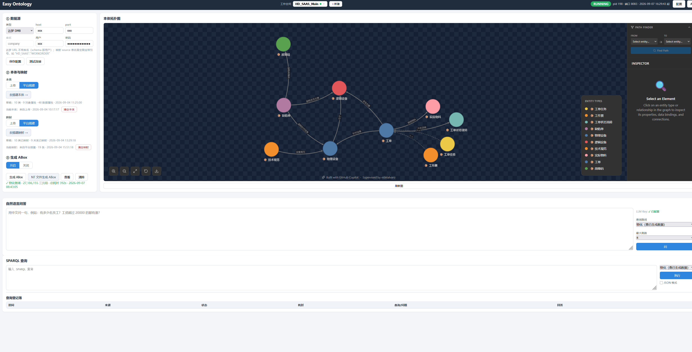
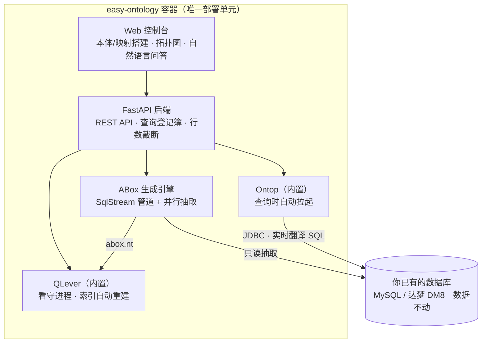
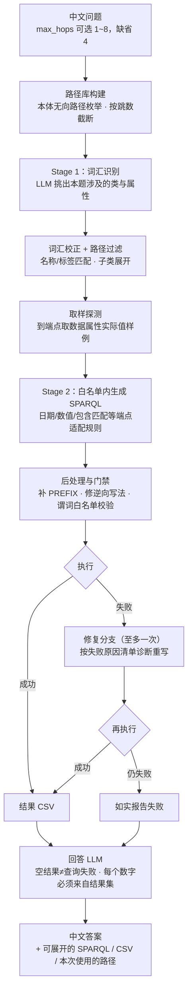

# Easy Ontology

**一个容器，把关系数据库变成知识图谱：可视化搭建本体与映射 → SPARQL / 自然语言问数。零配置、零外部依赖，几分钟跑通 MVP。**

Self-hosted OBDA (Ontology-Based Data Access) platform in a single Docker container: visually build OWL ontologies & mappings, query any relational database with SPARQL or plain Chinese, and integrate into Dify / LLM workflows via ready-made REST APIs.


## 为什么是 Easy Ontology？

传统 OBDA 工具链：装 Protégé 建本体、手写映射文件、命令行起引擎、再自建查询前端——四件事四个工具。Easy Ontology 把它们收进**一个网页、一个容器**：

- **简单** — 浏览器里点选建类、建属性，三步向导生成映射，实时拓扑图预览，不装任何桌面软件
- **零配置** — 没有配置文件要改；[Ontop](https://ontop-vkg.org/)（虚拟）与 [QLever](https://qlever.cs.uni-freiburg.de/)（物化）两个引擎内置同一容器，查询自动拉起、ABox 变化索引自动重建，**用户不部署、不启动、不维护任何引擎**
- **快** — 配好数据源到能问答只要几分钟；千万级数据一键物化约 7 分钟（自研并行引擎）
- **可对接** — `/sparql`、`/api/ask` 等 REST API，Dify / 外部系统改个 URL 就能接；多工作空间隔离，多套本体/数据源一键切换

**适合**：给现有数据库快速搭一个知识图谱 **MVP**；验证本体/映射设计是否行得通；给 LLM 应用接结构化数据；教学与演示。

支持 **MySQL** 与 **达梦 DM8**（国产数据库友好）。



## 快速开始

```bash
docker run -d --name easy-ontology \
  -p 8010:8000 \
  -v easy-ontology-data:/app/data \
  --add-host=host.docker.internal:host-gateway \
  --restart unless-stopped \
  zddsl/easy-ontology:latest
```

**容器启动后，浏览器访问 `http://localhost:8010`** 即可进入控制台（部署在其他机器就把 `localhost` 换成机器 IP）。

> 国内拉取 Docker Hub 慢或超时？配置镜像加速器，或代理放行 `registry-1.docker.io`。

源码构建：`git clone https://github.com/zddsl/easy-ontology.git && cd easy-ontology && docker compose --profile prod up -d --build`

### 首次使用三步

1. **① 数据源** — 填 MySQL/DM8 连接信息，点「测试连接」（数据库在宿主机上，host 填 `host.docker.internal`）
2. **② 本体与映射** — 上传现成的 `.rdf`/`.obda`，或切到「平台搭建」可视化搭建
3. **查询** — 直接写 SPARQL，或在底部用中文提问（顶栏「配置」里填 [DeepSeek API Key](https://platform.deepseek.com/)）

想要物化加速？点一下「③ 生成 ABox」，索引自动构建，无需任何维护。

## 架构



| 引擎 | 工作方式 | 适合 |
|------|---------|------|
| **Ontop**（虚拟） | SPARQL 实时翻译成 SQL 直查数据库，不落盘 | 数据频繁变化，要最新结果 |
| **QLever**（物化） | 数据物化成三元组，索引秒级图查询 | 大数据量、复杂关联分析 |

## 自然语言问答

> 「有多少名员工？」「这台设备的工单都领用了哪些物料？」

两阶段管线：先让 LLM 从本体路径库挑出本题的类与属性，再在**白名单内**生成 SPARQL（只准用本体里真实存在的谓词）；执行失败自动修复重写一次；回答层每个数字必须来自查询结果，查询失败与空结果严格区分。`max_hops` 参数（1~8，缺省 4）控制最大关联跳数。



## 对外 API

平台本身就是查询网关，外部系统（Dify、脚本、大屏）直接调用：

```bash
# SPARQL 查询（route 可省略，默认 virtual；生成过 ABox 后可用 materialized）
curl -X POST http://localhost:8010/sparql -H "Accept: text/csv" \
  -d "query=SELECT ?s WHERE { ?s ?p ?o } LIMIT 10"

# 自然语言问答（max_hops 可省略，默认 4）
curl -X POST http://localhost:8010/api/ask -H "Content-Type: application/json" \
  -d '{"question": "有多少条工单？", "route": "materialized", "max_hops": 4}'

# 本体摘要（喂给外部 LLM 做提示词）
curl http://localhost:8010/api/ontology/summary
```

完整接口与参数见页面顶栏 **API** 按钮。

## 开发与维护

```bash
docker compose --profile dev up --build        # 开发：源码热重载
bash deploy/qlever/run-dev-container.sh --force # 外置 QLever 开发容器（镜像按 digest 钉死）
bash deploy/qlever/regression-limit.sh          # 升级 QLever 后跑对拍回归
docker build --target prod -t zddsl/easy-ontology:latest . && docker push zddsl/easy-ontology:latest  # 发布
```

## 致谢

- [Ontop](https://ontop-vkg.org/) (Apache-2.0) — 虚拟知识图谱引擎，`ontop-cli-5.5.0/` 随仓库分发
- [QLever](https://qlever.cs.uni-freiburg.de/) (Apache-2.0) — 超高性能 RDF 索引与查询，二进制取自官方镜像内置分发
- [WebVOWL / Ontology Playground](https://github.com/VisualDataWeb/Ontology-Playground) — 拓扑图可视化

## License

[MIT](LICENSE)
